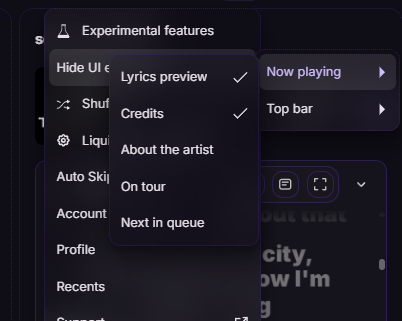

# Hide UI Elements

*scram*

A Spicetify extension for switching off the bits of Spotify's now-playing panel and top bar you
don't want.

<p align="center">
  
</p>

## Toggles

| Group | Elements |
|---|---|
| Now playing | Lyrics preview, Credits, About the artist, On tour, Next in queue, Switch to video |
| Top bar | Studio button |

They live under "Hide UI elements" in the Spicetify menu, behind your profile picture. Ticking one
takes effect straight away and sticks after a restart. Lyrics preview, Credits, Switch to video and
the Studio button start off hidden.

## Install

From Marketplace, search "Hide UI Elements" under Extensions.

By hand, put `hide-ui-elements.js` in `%APPDATA%\spicetify\Extensions` (or
`~/.config/spicetify/Extensions` on Linux and macOS) and run:

```
spicetify config extensions hide-ui-elements.js
spicetify apply
```

## Config

`GROUPS` sits at the top of the file. A row adds a toggle, a group adds a submenu.

```js
{ id: "credits", label: "Credits", selector: ".main-nowPlayingView-credits" },
```

## Notes

- Nothing here anchors on a hashed class like `y6MSp2Cg3wf9ZqdX` or on visible text, so the toggles
  survive Spotify updates and work in any language. Encore's `e-10810-*` classes look safe but carry
  a version prefix, so they're out too. The source comments cover each selector.
- "Switch to video" hides its container instead of the button. A `Loading` placeholder sits beside
  it holding 109px of its own, so hiding the button alone just leaves a gap.
- Coming from v1: delete `hide-npv-sections.js` and `hide-studio-button.js`, then take them out of
  your `extensions =` line. Your settings carry over on first run.
- Built against Spotify 1.2.99.317 and Spicetify 2.44.0. Needs `:has()`.

## License

MIT
