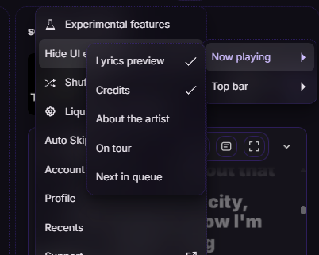

# Hide UI Elements

*scram*

Spotify's now playing panel keeps accumulating sections and there's no setting for any of them. This
adds one. Nine, actually.

<p align="center">
  
</p>

## What it turns off

| Group | Elements |
|---|---|
| Now playing | Lyrics preview, Credits, About the artist, On tour, Merch, Next in queue, DJ "no queue" notice, Switch to video |
| Top bar | Studio button |

All under **Hide UI elements** in the Spicetify menu, behind your profile picture. Tick one and it's
gone, no `spicetify apply` and no restart. Lyrics preview, Credits, Switch to video and the Studio
button are off by default, as are Merch and the DJ notice.

The DJ toggle is the odd one out: it hides the "The DJ doesn't have a queue" panel while Spotify DJ
is playing, and leaves the normal Next in queue list alone the rest of the time. Same element, two
toggles.

## Install

Marketplace: search "Hide UI Elements" under Extensions.

Or drop `hide-ui-elements.js` in `%APPDATA%\spicetify\Extensions`
(`~/.config/spicetify/Extensions` on Linux and macOS) and run:

```
spicetify config extensions hide-ui-elements.js
spicetify apply
```

## Adding your own

`GROUPS` is at the top of the file. A row adds a toggle, a group adds a submenu.

```js
{ id: "credits", label: "Credits", selector: `${PANEL} > div:has([data-encore-id="listRow"]):not(:has(ul))` },
```

Add `when: "<condition>"` and the rule only applies while that condition holds. `CONDITIONS` sits
just below `GROUPS`: each one stamps true/false on `<html>` and the generated CSS is scoped to that
attribute, so reacting to playback is one attribute write rather than a stylesheet rebuild.

```js
{ id: "queuedj", label: "DJ \"no queue\" notice", selector: `${PANEL} > div:has(> ul)`, when: "dj" },
```

## Selector notes

Some elements get nothing but a generated class name like `y6MSp2Cg3wf9ZqdX`, which lasts until the
next update. Encore's utility classes have a version number sitting in the middle of them
(`e-10810-text`), so they're no safer. Matching on visible text breaks as soon as someone runs
Spotify in French. Nothing here does any of those, and the source comments say what each selector
keys off instead.

Merch keys off its product links pointing at `shop.spotify.com`. The section itself and every
element inside it carry hashed classes only, so there was nothing else to hold on to.

"Switch to video" hides its container rather than the button. Hide just the button and you get a
109px gap, because there's a skeleton placeholder beside it, a div labelled `Loading`, holding the
space whether anything loads or not. Collapsing the container hands that width to the track title,
which stops it being truncated. That part was an accident.

The `dj` condition reads `agentic_product_type` out of the playback context's metadata. The notice's
own wording is English-only and the DJ playlist id is a hardcoded id Spotify can rotate, so neither
is worth keying off.

Built against Spotify 1.3.3.264 and Spicetify 2.45.3. Needs `:has()`.

Spotify 1.3 hashed the old `.main-nowPlayingView-*` classes, which is what broke every selector in
1.2.0 except the Studio button. Sections are now matched by what's inside them under the panel's
`data-testid`: a `ul` for the queue, a `listRow` for credits, `/concert/` links for On tour, a
heading with plain text and nothing else for the DJ notice. "Switch to video" is the middle child of
the cover row, and only when something follows it. Every toggle was checked live on 1.3.3, DJ
playback and a video track included.

## Snippets

`snippets/` holds CSS repairs for Marketplace snippets that died on Spotify 1.3, plus one fix for a
theme problem. Paste the contents into Marketplace's custom CSS, or install them from the folder.

| File | What it does |
|---|---|
| `smaller-right-sidebar-cover.css` | 85px Now Playing cover with the title and artist beside it. Handles video tracks, and the tracks where Spotify floats the header over the cover. |
| `queue-top-side-panel.css` | Moves Next in queue above the other sections. |
| `remove-connect-bar.css` | Hides the "Playing on <device>" strip. |
| `menu-blur-fix.css` | The profile and right-click menus were see-through under the Lucid theme. Its blur rules stopped matching, so this puts the blur back and firms up the fill. |

All four were tested on 1.3.3. The same caveat applies as above: a future Spotify update can hash
something new, and these anchor on `.NowPlayingView`, `data-testid` and `role="menu"` because
those have survived so far.

## License

MIT. Hide whatever you like.
